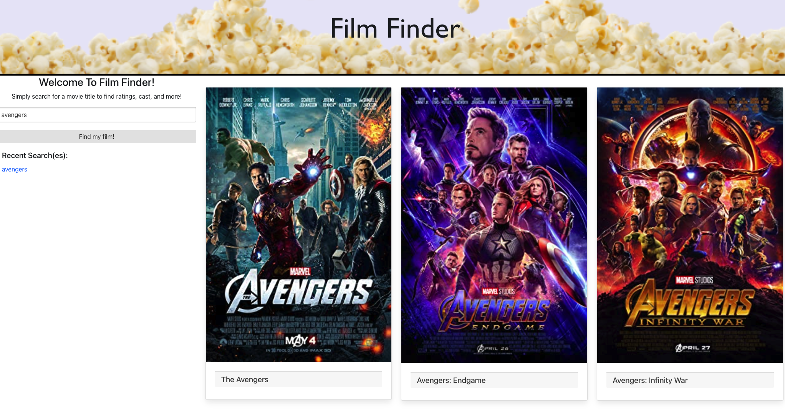

# Movie Search

## Primary Functions
This website will allow a user to find out valuable information about any movie. 
<br>The user will type the title of a movie in the search bar, then the browser will return a photo of the movie cover to verify that is the movie they are looking for. 
<br>Once the user clicks on the photo of the movie cover, the browser will then fetch information on that movie from a separate source. 
<br>The page will then display information on that movie such as movie length and ratings. 
<br>The movie search will be saved in a 'recents' section where it can be accessed even after the browser is refreshed.


## User Story
```
AS a movie watcher
I WANT to find information on a movie I search
SO THAT I can decide if it is worth watching
```

## Acceptance Criteria
```
GIVEN a search bar
WHEN I search a movie title
THEN the page displays the movie's poster
WHEN I click on the movie's poster
THEN the page will display information about the movie
WHEN I leave the page
THEN I should be able to come back and see old searches

```
## Technologies/Tools used
- **Wireframing:**  `Lucid Charts` 
- **Language:** `JQuery`, `JavaScript`
- **CSS frameworks:**  `Bootstrap` & `Bulma`
- **Storage:** `LocalStorage`
- **API Resources:** `OMDB` & `IMDB`

## Breakdown of tasks and roles
- **Natalie Sleem:** Bulma programmer
	- [github/nataliesleem](https://github.com/nataliesleem)

- **Cole Simpson:** Bulma & JavaScript programmer
	- [github/cole22simpson](https://github.com/cole22simpson)

- **Ravnish Gupta:** Program Manager, Git Repo, JavaScript and JQuery programmer
	- [github/ravnishgupta](https://github.com/ravnishgupta)

- **Jayson Cobbs:** individual contributor
	- [github/jaysoncobb](https://github.com/jaysoncobb)

## Screenshots




## Directions for Future Decelopment
- Improve the UI 
- Advanced search / filter capability, e.g. ratings, cast, genre
- Content availability venue(s) 
- Recommendation Engine based on user search
- Use a database instead of LocalStorage
- Ability to purchase tickets at a theater near you!

## :point_right:  Github [link](https://ravnishgupta.github.io/movie-search/) to the deployed application


